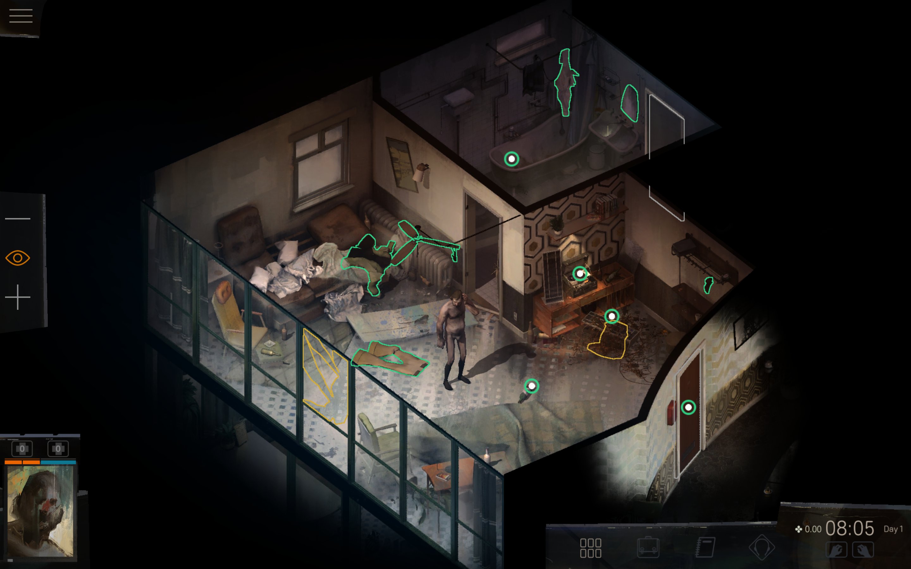

#  Disco Elysium Touch Overlay 
An Overlay for Disco Elysium, making the game fully playable with touch input only!

&nbsp;

## 🪶 Portable, no installation required
Simply run the executable, it will automatically detect the game and show up. If you wish to stop it, look for the  tray icon.

&nbsp;

## 🤔 What does it do?
The app creates two ToolWindows that float on top of the game and get hidden when it's not active. They blend right in with the rest of the game's UI and allow you to zoom in & out, toggle focus/highlight mode and access the menu.

&nbsp;

## Screenshots

 

&nbsp;

## 🤓 Don't trust a random executable from the internet? Compile it yourself!
You'll need [AutoHotkey v2](https://www.autohotkey.com/download/ahk-v2.zip)(!). You can simply run the script directly or compile it to an executable with [Ahk2Exe](https://github.com/AutoHotkey/Ahk2Exe).
